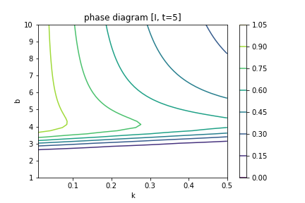
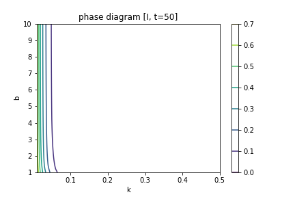
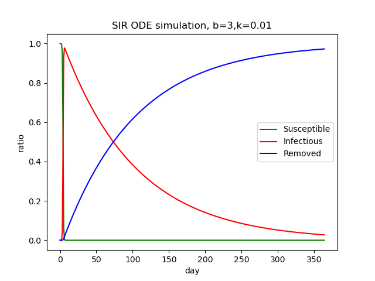

# Agent-Based and Ordinary Differential Equation Modelling of SIR Model

## Introduction to the SIR Model
The SIR model is a compartmental epidemiological model which assumes everyone in a population falls into one of three compartments: Susceptible, Infectious, and Recovered (sometimes referred to instead as Removed). The Susceptible population consists of those who have not yet gotten the virus and thus are _susceptible_ to becoming infected. Infectious individuals are those who carry the virus and are capable of infecting others for some period of time before eventually transitioning into the Removed group. Lastly, Removed individuals are those who are no longer part of the system because they have either acquired immunity or died from the disease. 

The trajectory of the disease generally depends on the parameters `b`, the per capita number of interactions capable of spreading the disease that occur per day, and `k`, the rate at which Infected individuals move into the Removed compartment. Notably, the basic SIR model assumes that all agents in the population interact randomly so every Susceptible individual shares an equal chance of becoming infected in each period. I.e. the probability for any given Susceptible individual to become infected in a period is `b * I/N`. Additionally, `k` can be interpreted as the reciprocal of the mean duration of infection when duration of infections are exponentially distributed (1). For Covid-19, no conclusive figure has been established as the mean duration of infection. However, the US CDC estimates that the majority of cases become no longer infectious within 10 days, though some serious cases can remain infectious for up to 20 days (2). 

## Structure of the `sir` Package
This version of the `sir` package contains implementations of classes that facilitate analysing the trajectory of Covid-19 using the SIR model. The `sir` folder currently contains a module for agent-based modeling, `abm`, as well as a module for modeling as a system of ordinary differential equations, `ode`. 

The `test` folder contains the script `test.py` which can be run using `unittest` or `pytest` to verify the integrity of the `abm` and `ode` modules. The test is also continuously integrated using GitHub Actions. 

Scripts used for generating the phase diagrams and simulation results presented later in this report are held in the `sctipts` folder.

## Results
### Agent-Based Model (Discrete Model)

### Ordinary Differential Equation Model (Continuous Model)

Some phase diagrams.

t=5, `Infectious`

t=10, `Infectious`

t=50, `Infectious`

Some time figures.

b=3, k=0.01

b=3, k=0.1

b=0.8, k=0.01

## Possible Extensions/ Variations
### Allow for different rates of interaction between certain individuals
This could apply to situations such as within-household transmission versus across-household transmission. The aim of this extension would be to relax the assumption that all members of a population interact with each other at a constant rate. It is easy to imagine that the rate of interaction between family members or neighbors tends to be much higher than the rate of interaction between strangers.

### Use agent-based modelling to show the effect of (incomplete) mask usage
Suppose agents are separated into two 'types': those who wear masks and those who don't. Wearing a mask reduces the risk of spreading Covid-19 (conditional on being Infected) by xx% and reduces the risk of becoming Infected (conditional on being Susceptible and coming into contact with an Infected) by yy%. What is the relationship between the proportion of mask users and spread of Covid-19? I.e. Is it linear or non-linear? Are there any positive or negative externalities that affect either type that results?

### Adding a compartment for "Exposed" individuals, turning the model into the SEIR model
Suppose there is a policy for individuals to voluntarily quarantine themselves if they believe they have been exposed to the virus. Then suppose being in quarantine reduces the number of interactions that that individual has. Could potentially make the rate at which individuals enter the Exposed category a function of Covid-19 cases to simulate the several waves of the virus that we are experiencing.

### Assume immunity is temporary and model the effects of a vaccine that takes time to roll out/ is not universally adopted
Assume a vaccine comes out that grants temporary immunity to Covid-19. Further assume that only a relatively small portion of the population is able to gain access to the vaccine in each time period. How will the overall trajectory of Covid-19 look? Is there a minimum threshold for speed/ extent of vaccine adoption in order for it to be effective?

## References:
1. Martcheva, M. (2015). An introduction to mathematical epidemiology. Heidelberg, New York: Springer. doi:10.1007/978-1-4899-7612-3
2. Clinical Questions about COVID-19: Questions and Answers. (n.d.). Retrieved November 09, 2020, from https://www.cdc.gov/coronavirus/2019-ncov/hcp/faq.html